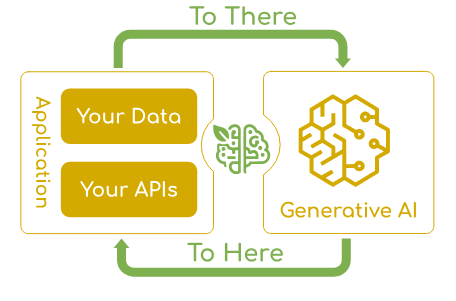
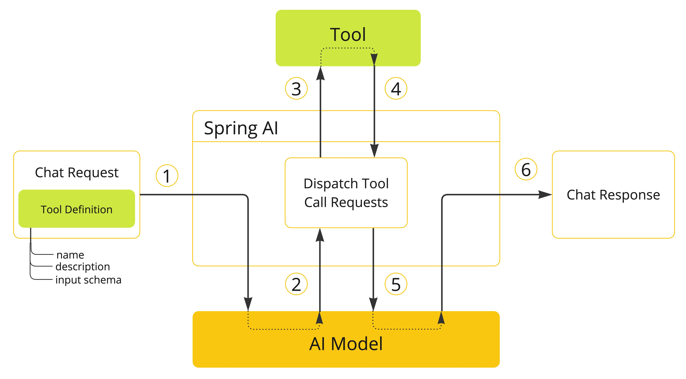
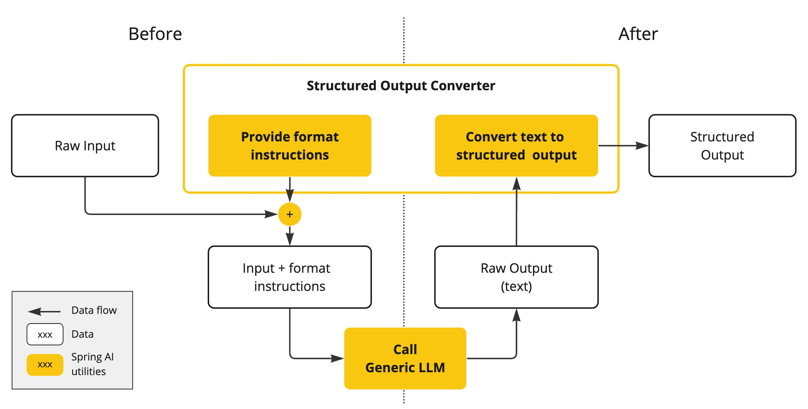
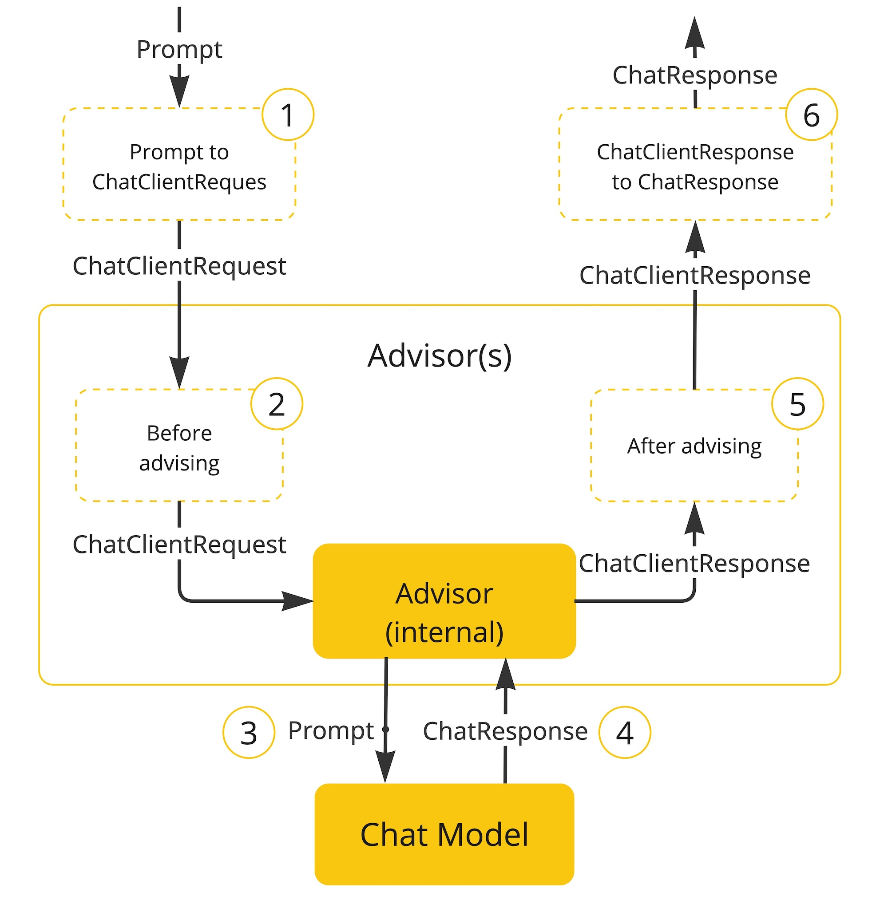
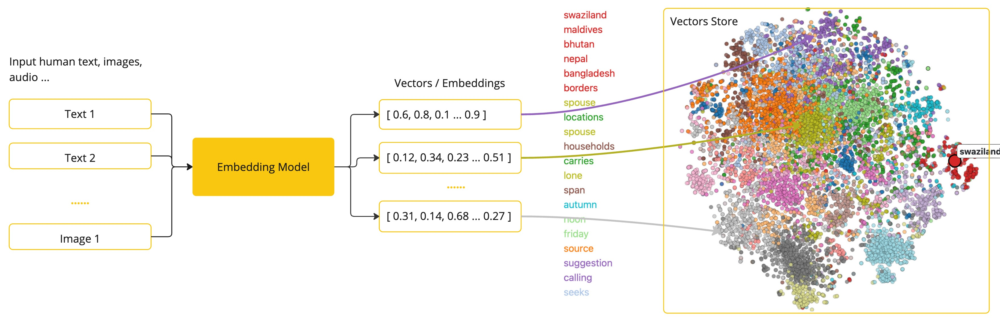

# Spring AI 1.0.1

- **Aperçu général**
- **Sorties structurées**
- **Appels d’outils (Tool Calling)**
- **API** **_Advisors_**
- **RAG** **Pipeline ETL** **Vector Store**

## Aperçu général

## Appels d’outils (Tool Calling)

## Sorties structurées

## API Advisors

## RAG, pipeline ETL, Vector Store

## Observabilité
http://localhost:8081/actuator/metrics/gen_ai.client.token.usage